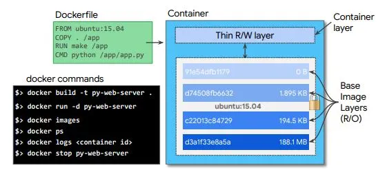

# Docker
---

# Organizační informace

Online poznámky: <https://codimd.trask.cz/s/rJPCa8C0v>

Adam Morávek 
amoravek@trask.cz 
+420 724 514 916 

---
# Co to je Docker? (1)

- nástroj, který zjednodušuje
  - výrobu *images*
  - spouštění *kontejnerů*
  - jejich správu
  - komunikaci s registry

.footer: [5 min]

---
# Co to je Docker? (2)

- cli + daemon (api server s root oprávněním)
- chytré využití funkcí jádra **Linuxu** (namespaces, cgroups) - <https://www.nginx.com/blog/what-are-namespaces-cgroups-how-do-they-work>
- "virtualizace" aplikací

---
# Co to je Docker především?

- nástroj, který extrémně usnadňuje práci - ukázky:
  - legacy WAS
  - redis
  - příklad TIF komponent
  - ...

---
# ...je to **nástroj**, který umožňuje:

- vytvořit artefakt schopný běhu všude tam, kde je *OCI* runtime
- zapouzdřit aplikaci včetně jejího prostředí
- redukovat problémy při nasazování aplikací (aplikace + kontext + fs OS)
- řešit podobné úlohy jako VM, ale s lepším využitím zdrojů

.notes: zminit napr. komplexitu nasazeni webapp na vice AS, vice OS, apod.

.notes: redukce problemu = redukuje pacive problemy dneska, prinasi ale nove (nova tech.)

---
# Co Docker není?

- virtualizace jak ji známe (VMWare, VirtualBox, KVM, ...)
  - z toho plyne i nižší míra izolace

.footer: Základy Docker a Kubernetes 12/2022

---
# Srovnání s VM

.footer: [5 min]

.notes: zmínit prakticky okamžité spuštění oproti nutnosti bootu VM

.notes: zmínit řádové snížení velikosti image oproti VM

---
# Linux kernel

.footer: [5 min]

- Docker je produkt založený na vlastnostech a funkcích jádra **Linuxu**
- nefunguje nativně např. na AIX, Windows ani macOS (jen s virtualizační mezivrstvou)
- všechny kontejnery (viz dále) sdílí s host OS jeho linux kernel -> rychlý "start"
- kontejnery nejsou nic jiného než běžné procesy uzavřené do vlastního namespace a se zdroji omezenými za pomocí control groups (obojí funkce linuxového jádra)
- kontejner tedy není žádný "aktivní obal", ale jen logicky izolovaný proces, který se tváří jako samostatná VM

---
# Motivace

.footer: [5 min]

- distribuce neměnného balíčku (=docker image) k zákazníkovi
- image se nedají měnit, ale může se z nich *dědit*
- docker image obsahuje vše potřebné pro spuštění aplikace
- image lze digitálně podepsat
- součástí image i kompletní souborový systém OS - např. OS CVE lze řešit rebuildem image
- image se verzují
    

        docker run \
        --name was \
        -p 9043:9043 \
        -p 9443:9443 \
        -d ibmcom/websphere-traditional:latest

(heslo je v kontejneru v /tmp/PASSWORD)

---
# Image

.footer: [5 min] 

## Co je vlastně image?

- lze si představit jako .tar.gz souborového systému OS + nějaká metadata
- *image* je vždy read-only, vytváří se *buildem*
- image se většinou zakládá na nějakém již existujícím - např. JDK image dědí z Alpine linux image a dodá instalaci JDK
    

        !dockerfile
        FROM alpine
        RUN <instalace jdk>

(je to něco jako vzít souborový systém Alpine linuxu, nakopírovat tam JDK, zazipovat a obalit metadaty)

---

# Parent a base image (1)

.footer: [5 min] 

- parent image referencován instrukcí `FROM`
- parent images dostupné např. na Docker HUB
- kde je ale root image? Je to image s `FROM scratch`, ale častěji se vytváří importem zazipovaného souborového systému:

.notes: zmínit absenci init

.notes: scratch je rezervovaný název - prázdný parent image

---
# Parent a base image (2)

    !bash
    $ sudo debootstrap xenial xenial > /dev/null
    $ sudo tar -C xenial -c . | docker import - xenial

    a29c15f1bf7a

    $ docker run xenial cat /etc/lsb-release

    DISTRIB_ID=Ubuntu
    DISTRIB_RELEASE=16.04
    DISTRIB_CODENAME=xenial
    DISTRIB_DESCRIPTION="Ubuntu 16.04 LTS"    

---

# Současný trend - mikroskopický image

- image, který obsahuje jen aplikaci
- nemá ani shell
- všechny závislosti součástí aplikace (např. golang, ale i c, cpp, quarkus? micronaut?)
- velmi malý image - rychlé stažení z registry
- malá útočná plocha
- není možné "vlézt dovnitř" (důraz na sběr logů a metrik)

---
# Kontejner

.footer: [5 min] 

- *kontejner* je vlastní aktivní proces spuštěný nad souborovým systémem z image (lze si představit jako *instanci* image)
- kontejner přidává nové fs vrstvy nad image 
- spuštění kontejneru s aplikací = spuštění procesu aplikace na systému, kde běží Docker daemon, ale proces je izolován ve vlastním *namespace* a běží jako root proces (PID 1)
- root procesem host OS je zpravidla initd nebo systemd - kontejner init proces nemá, protože nebootuje, začíná přímo spuštěním procesu

---
# Docker daemon

.footer: [5 min] 

- proces běžící na pozadí (root oprávnění)
- spravuje Docker objekty (image, kontejnery, síť, úložiště)
- občas je potřeba změnit konfiguraci: /etc/docker/daemon.json (typicky kvůli insecure registry)
- musí běžet jako root - často terčem kritiky (v kombinaci s root právy uživatele v kontejneru)

---
# OCI

.footer: [5 min] 

- Open Container Initiative
- představuje otevřený standard rozhraní container runtime a formátu image
- díky OCI mohlo Kubernetes opustit docker daemon a přejít na containerd
- vzhledem k raketovému rozvoji kontejnerizace je OCI nutnost
- mezi OCI-compliant runtime patří např. docker, cri-o a containerd (docker již ale interně používá containderd)

---

# Docker - alternativy (1)

- několik aspektů:
  - runtime (spouštění kontejnerů)
    - runc, crun
    - containerd
    - cri-o
  - vytváření images (build)
    - buildah
    - BuildKit
    - JIB
    - Kaniko
    - ...

OCI (Open Container Initiative - <https://opencontainers.org/>)

Viz <https://blog.logrocket.com/docker-desktop-alternatives>

---
# Docker - alternativy (2)

Proč vlastně?

- Docker daemon (root) - komu to ale vadí?
- Docker opustil Kubernetes-based platformy
- ...je to ale stále extrémně užitečný nástroj pro DEV
  - spolu s např. docker-compose

---

# Docker CLI

.footer: [5 min] 

- základní (a naprosto dostačující) utilita pro vytváření, správu a manipulaci s docker objekty
- build image: `docker build -t myimage:1.0` .
- spuštění kontejneru:
    

        !bash
        docker run -d \
        --name mycont1 \
        -p 8088:8080 \
        myimage:1.0

---
# Dockerfile a build image

.footer: [5 min] 

- textový soubor obsahující instrukce pro build image
- proprietární formát
- pokud není určeno jinak, předpokládá se název `Dockerfile`

---
# Příklad (1)

.footer: [5 min]

(examples/docker-simple)

    !dockerfile
    FROM nginx:alpine
    COPY . /usr/share/nginx/html

.notes: objasnit nginx:alpine

Vytvoříme image:

    docker build -t docker-simple:0.1 .

Spustíme (poběží pak na <http://localhost:8881>):

    docker run -ti --rm -p 8881:80 docker-simple:0.1

Obecný formát:

    docker <group> [options] <image> [command]

---
# Příklad (2)

Zastavíme kontejner (běží na popředí): Ctrl+C (pošle SIGINT, ne SIGKILL)

Spustíme na pozadí:

    !bash
    docker run -d \
    --name docker-simple \
    -p 8881:80 \
    docker-simple:0.1

Ověříme, že běží:

    !bash
    docker ps
    docker logs -f docker-simple

---
# Příklad (3)

Prozkoumáme kontejner (pocitově jsme *jako kdyby* ve VM):

    !bash
    docker exec -ti docker-simple sh
    cd /usr/share/nginx/html
    ls -l

Vypíše:

    !bash
    50x.html    Dockerfile  build.sh    index.html

Pokusy:

    !bash
    hostname
    ps
    ls -la /
    uname -a
    cat /etc/*release

---
# Příklad (4)

Uklidíme:

    !bash
    exit
    docker ps
    docker stop/kill docker-simple
    docker ps -a
    docker rm/rm -f docker-simple
    docker ps -a

...a nikde nic...EPHEMERAL! :-)

(pozor, spolu s kontejnerem zmizí i vše, co vyprodukoval, pokud neprodukoval na VOLUME - viz dále)

---
# docker kontext

.footer: [5 min] 

...vraťme se ještě na slide **[Příklad (3)](#slide:14)**: co tam dělá Dockerfile a build.sh???

Chtěli jsme to přece: `COPY . /usr/share/nginx/html`

Řešení je snadné - filtrace kontextu pomocí `.dockerignore` (obdoba .gitignore) - např.:

    !bash
    .git
    .cache
    target
    **/*.class
    *.md
    !README.md

...a pro **náš** příklad:

    !bash
    *.sh
    Dockerfile*

Zkusme tedy nový build... (také např. <https://github.com/argoproj/argo-cd>)

---
# Přestávka do 10:45

.footer: [15 min]

---
# Dockerfile - příkazy (1)

.footer: [15 min] 

Inspirace: <https://repogit.trask.cz/git/BI_Docker>

Vybrané příkazy:

- [`FROM`](<https://docs.docker.com/engine/reference/builder/#from>)
- [`ADD`](<https://docs.docker.com/engine/reference/builder/#add>)
- [`COPY`](<https://docs.docker.com/engine/reference/builder/#copy>)
- [`RUN`](<https://docs.docker.com/engine/reference/builder/#run>)
- [`USER`](<https://docs.docker.com/engine/reference/builder/#user>)
- [`WORKDIR`](<https://docs.docker.com/engine/reference/builder/#workdir>)

---
# Dockerfile - příkazy (2)

- [`EXPOSE`](<https://docs.docker.com/engine/reference/builder/#expose>)
- [`VOLUME`](<https://docs.docker.com/engine/reference/builder/#volume>)
- [`ENTRYPOINT`](<https://docs.docker.com/engine/reference/builder/#entrypoint>)
- [`CMD`](<https://docs.docker.com/engine/reference/builder/#cmd>)
- [`ENV`](<https://docs.docker.com/engine/reference/builder/#env>)
- [`ARG`](<https://docs.docker.com/engine/reference/builder/#arg>)

---
# Čas na příklad

- build image z Dockerfile
- base image: alpine (ale je to na vás, alpine se ale stáhne rychle) (FROM)
- použijte .dockerignore
- do image dodejte 2 nebo více textových souborů (**COPY** / ADD)
- po **spuštění** image (pozor, nejedná se o RUN v Dockerfile!):
  - zobrazte obsah textového souboru (cat) zadaného parametrem v docker run ...
    - pou6ijte ENTRYPOINT a CMD
  - pokud nebude zadán parametr, zobrazte jeden ze souborů

---
# Řešení

    !dockerfile
    FROM alpine

    COPY my1.txt /
    COPY my2.txt /
    WORKDIR /

    ENTRYPOINT ["cat"]

    CMD ["my1.txt"]

---
# PID 1, exec vs shell formy

.footer: [25 min] 

Existence kontejneru je přímo spojena s životem procesu s PID 1 a správná propagace signálů (`SIGTERM`, `SIGINT`) k hlavnímu procesu (korektní ukončení)

Rozdíl mezi:

- `ENTRYPOINT "/app/bin/your-app arg1 arg2"` (shell-form) - signály přijme sh, který je NEPROPAGUJE
- `ENTRYPOINT ["/app/bin/your-app", "arg1", "arg2"]` (exec-form) - signály přijme your-app

(ukázat exit code)

Pěkně vysvětleno:
- <https://hynek.me/articles/docker-signals/>
- <https://engineering.pipefy.com/2021/07/30/1-docker-bits-shell-vs-exec/>

---
# Co je linux exec?

"The exec() family of functions **replaces** the current process image with a new process image."
<https://man7.org/linux/man-pages/man3/exec.3.html>

    !bash
    ./app.sh:
    - sh -c
      - /app.sh

vs

    !bash
    exec ./app.sh
    - /app.sh

---
# Příklad

    !dockerfile
    FROM ubuntu
    ENTRYPOINT top -b
    CMD ["-c"]

vs

    !dockerfile
    FROM ubuntu
    ENTRYPOINT ["top", "-b"]
    CMD ["-c"]

pak Ctrl+C a sledovat výstup echo $?

---
# Proč existuje SHELL forma?

Protože v ní lze použít proměnné prostředí (narozdíl od EXEC):

    !dockerfile
    FROM alpine
    ENV VAR1=abc
    CMD echo $VAR1

vs

    !dockerfile
    FROM alpine
    ENV VAR1=abc
    CMD ["echo", "$VAR1"]

---
# Build a vrstvy (1)

.footer: [10 min] 

---

# Build a vrstvy (2)

- Každý příkaz v rámci Dockerfile = vrstva v souborovém systému
- vrstvy jsou read-only, zápisová je jen ta "vrchní"
- copy-on-write
- vhodná organizace vrstev tak, aby je nebylo nutné zbytečně buildovat/stahovat
- každá vrstva se ukládá do cache (hash) a lze ji využít i v jiném image (build, pull, push)

Dokumentace: <https://docs.docker.com/storage/storagedriver/>

---
# Build a vrstvy (3)

---
# Multi-stage build (1)

.footer: [20 min]

- složitý build může zanechat spoustu nepotřebných dat (i když si dáme pozor)
- jednodušší je provést např. maven build někde jinde (v nějakém jiném kontejneru) a pak jen zkopírovat výsledný artefakt:
  

        !docker
        FROM alpine:latest AS builder
        <nějaký build>
        <artefakt uložen do /git/app/target/app.jar>
        FROM centos:8
        COPY --from=builder /git/app/target/app.jar /deployments/
        ...

---
# Cvičení - prerekvizity

- Docker zavedl maximální počet stažení pro neplatiče
- v Trasku ale máme cache (Harbor) - login viz <https://codimd.trask.cz/s/rJPCa8C0v>
- image prefixy:
    

        !bash
        harbor.trask.cz/dockerhub-proxy/xxx/yyy[:<verze|latest>]
        harbor.trask.cz/dockerhub-proxy/library/xxx[:<verze|latest>]

- příklad:     
      

        !bash
        docker login harbor.trask.cz
        ...
        docker pull harbor.trask.cz/dockerhub-proxy/library/nginx
        docker pull harbor.trask.cz/dockerhub-proxy/tchiotludo/akhq:0.23.0

---
# Cvičení

Pokuste se optimalizovat následující Dockerfile:
(Git - examples/docker/multistage/Dockerfile)

    !dockerfile
    FROM ubuntu

    RUN apt-get update \
        && apt-get install -y maven git

    RUN git clone https://github.com/amoravek/k8s.git \
        && cd k8s/k8s-sample-app \
        && mvn clean package

    WORKDIR k8s/k8s-sample-app/target

    ENTRYPOINT ["java", "-jar", "/app/k8s-sample-app.jar"]
    CMD ["server"]

---
# Řešení

- oddělit apt sekci - kvůli cachování (následné buildy budou rychlejší)
- smazat apt cache ve stejné vrstvě
- git clone a maven build provést v jiném image (multistage)

---
# Multi-stage build (2)

- builder image je po použití smazán (nevytvoří se image, ale zůstávají vrstvy)
- je možné použít už existující image a jen zkopírovat data:
    

        !dockerfile
        FROM ubuntu:latest
        COPY --from=alpine:latest /etc/os-release /ALPINE

<https://docs.docker.com/develop/develop-images/multistage-build/>

Příklad s `ta:1.1.10` image - porovnat výslednou velikost
(vrstvy - apt install, multistage)

---
# Názvy images, Docker repository

.footer: [5 min] 

Název image: `[host:port/]<repository1>/<repository2>/.../<image-name>[:<image-version>]`

Např.:

- `trask/tif/mdr:3.1.21` (lokální registry)
- `harbor.trask.cz/arm64/keycloak:12.0.1` (remote registry)
- `localhost:5000/redis` ('remote' registry na localhostu)

Pokud chybí verze image, použije se `latest`
- nemusí vždy odkazovat ne tentýž image!!!

---
# Docker registry

- `[host:port/]` část z předchozího slidu = docker registry; pokud chybí je lokální
- image je tedy možné ukládat kromě lokální registry i do remote registry, např:
    

        docker push harbor.trask.cz/arm64/keycloak:12.0.1

- hostname a port je součástí názvu (FQN) image...i když to je divné, je to praktické (viz např. Kubernetes)
- i remote registry používá vrstvy, což VELMI urychluje

Příklad: push do remote registry, malá změna, nový push

---
# Secure/insecure

.footer: [5 min] 

- registry by měla být zabezpečená ([m]TLS, login, ...)
- insecure registry = registry nezabezpečená pomocí TLS
- Pokud se nejedná o registry na localhostu (výjimka), Docker se s ní vůbec nebaví:
    

        !bash
        Error response from daemon: Get https://myregistrydomain.com:5000/v1/_ping:
        http: server gave HTTP response to HTTPS client

- lze obejít úpravou `/etc/docker/daemon.json`:
    

        !json
        {
            "insecure-registries" : ["myregistrydomain.com:5000"]
        }

Příklad externí insecure registry (proč je to užitečné a proč se často nezabezpečuje)

---
# TLS

- pokud registry zabezpečíme self-signed certifikátem, máme stejně smůlu:
    

        x509 certificate signed by unknown authority error

nutno dodat certifikát do:
`/etc/docker/certs.d/<your_registry_host_name>:<your_registry_host_port>/ca.crt`

---
# harbor.trask.cz

---
# pull, push, tag, login/logout

.footer: [10 min]

Image, jeho správa a přesun do- a z registry:

- `docker tag`
- `docker push <image spec>`
- `docker pull <image spec>`
- `docker rmi`

Do registry je mnohdy nutný login:

- `docker login`
- `docker logout`

---
# Přestávka na oběd

.footer: [30 min - 1 h] 

---
# PID 1 podrobněji

.footer: [30 min] 

Příklad: `git/examples/exec-shell/`

---
# Uživatelské účty a oprávnění uvnitř kontejneru, USER

.footer: [15 min] 

- drtivá většina kontejnerů vytvořených z nějakého image na Docker HUBu používá `USER root`
- není to bezpečné - za určitých okolností takto lze získat přístup k host OS
- v Dockerfile je možné použít libovolné množství `USER <user>[:<group>]` nebo `USER <UID>[:<GID>]`
- to, pod jakým uživatelem poběží `ENTRYPOINT` nebo `CMD` proces určuje předchozí `USER`
- uživatel nemusí předem existovat, pokud je použito UID
- pokud není specifikována skupina nebo GID, použije se skupina `root`
- pokud není použito `USER`, znamená to root

---
# Publikace portů, EXPOSE

.footer: [15 min] 

- kontejner po spuštění nepropaguje porty ven (jsou dostupné pouze interně)
- je potřeba explicitně určit, jaký port/rozsah bude publikován ven
- porty je třeba publikovat při vytváření kontejneru, pak už nejde (jednoduše) změnit
- pokud je port v Dockerfile explicitně označen pomocí `EXPOSE`, je možné použí automatiku:
    

        docker run -d --name nginx -P nginx

Příklad:

    !bash
    docker run -it \
    --name app1 \
    -p 5678:5678 \
    hashicorp/http-echo -text "Test OK"

---
# Volumes

.footer: [15 min]

- kontejner ukládá implicitně všechna data "do sebe"
- po sazání kontejneru (`docker rm`) přijdeme i o data
- řešením je `VOLUME` - můžeme provést mount externího adresáře, NFS, apod.
- dvě možnosti použití:
    - named volume:
        

            !bash        
            docker volume create myvol1
            docker run -d --name nginx -v myvol:/app nginx

         
        data volume se ukládají do `/var/lib/docker/volumes`

    - mount specifického adresáře z host OS: `docker run -d --name nginx -v /data:/app nginx`
    - modifikátor `:ro`

Příklady obou typů volume. <https://docs.docker.com/storage/volumes/>

---
# Networking, komunikace mezi kontejnery

.footer: [15 min] 

- kontejnery je možné připojovat do izolovaných sítí
- výhodou je např. izolace a automatické DNS

(ubuntu image, doinstalovat ping: `sudo apt install iputils-ping`, předvést oddědění image, kde je ping nainstalován)

    !bash
    docker network create mynet
    docker run -d --name app1 --network mynet ubuntu (pak ubuntu-ping)
    docker run -d --name app2 ubuntu (pak ubuntu-ping)
    docker network connect mynet app2

---
# Přestávka

.footer: [15 min]

---
# Docker best practices

.footer: [25 min] 

Projdeme <https://docs.docker.com/develop/develop-images/dockerfile_best-practices/>

Ukážeme si reálný projekt: ta:1.1.10

---
# Orchestrace – Docker Compose, Docker Swarm

.footer: [5 min] 

- s narůstající komplexitou Docker aplikací narůstá i potřeba orchestrace kontejnerů
- na počátku Docker Compose a Docker Swarm
    - ukázka Compose + network
- v současnosti Kubernetes, ostatní ale má stále svoje místo

---
# Přidělování CPU a paměti

.footer: [5 min] 

    !bash
    docker run -d \
    --name app1 \
    --cpus 2 \
    --memory 512m \
    ubuntu

<https://docs.docker.com/config/containers/resource_constraints/>

---
# Kontejnerizace Java aplikace, JIB

.footer: [55 min] 

- kontejnerizace existující aplikace vs nová aplikace
- je dobré volit vhodný base image pro kontejnerizaci a snažit se o jeho minimalizaci (útočná plocha, velikost, ...)
- z Docker HUBu brát VŽDY jen oficiální image !!!
- pokud není jiná možnost provést build ze zdrojáků GitHubu, které alespoň nějak překontrolujeme (kukaččí kontejner)

<https://github.com/GoogleContainerTools/jib/tree/master/jib-maven-plugin#quickstart>

---
# Diskuse 
