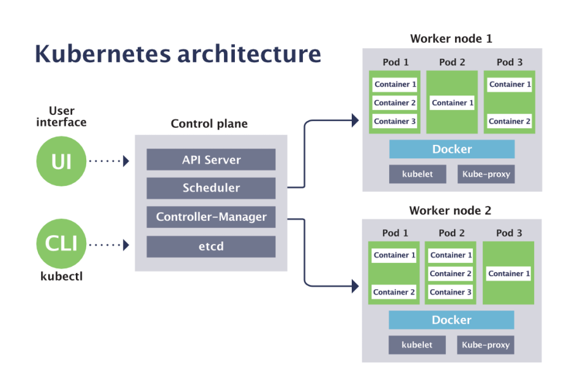

# Kubernetes I.

Online poznámky: <https://codimd.trask.cz/s/rJPCa8C0v>

Použitý cluster: <https://arm.lab.trask.cz/>

Adam Morávek, amoravek@trask.cz, +420 724 514 916

---
# Potřeba orchestrace kontejnerů

.footer: [5 min]

- organizovat několik málo kontejnerů s jednoduchou aplikací ješte celkem jde
- ale co dělat v momentě, kdy existuje celý ekosystém kontejnerů se specifickými potřebami na:
    - dostupnost
    - propustnost
    - bezpečnost
    - spravovatelnost
    - škálování
    - a mnohé další?
- je nevyhnutelné, aby existoval nástroj, který jednotnou cestou řeší tyto a mnohé další potřeby

---
# Kubernetes

.footer: [5 min]

- zavádí **deklarativní** přístup ke správě kontejnerizovaných aplikací
- v současné době jediná platforma, která dává dlouhodobý smysl jako cílová platforma pro kontejnerizované aplikace (můj osobní názor)
- snadno rozšiřitelný a modulární
- přenositelný téměř na jakýkoliv HW (viz https://arm.lab.trask.cz)
- velmi dobře navržený
- velmi dobře testovaný
- velmi dobře ***zdokumentovaný***
- bohužel ale...**velmi složitý**

---
# Příklad deklarativního způsobu konfigurace (YAML)

.notes: entry-backend

---
# Architektura Kubernetes (1)

.footer: [10 min] 

---
# Architektura Kubernetes (2)

- API server: centrální vstupní bod clusteru, REST API
- Scheduler: plánuje workload na konkrétní nody a hlídá jejich systémové zdroje (CPU, RAM, disk, ...)
- Controller-manager: *hlídá* stav (controllerů) clusteru (deklarovaný stav vs reálný stav)
- etcd: *uchovává* stav clusteru
- Kubelet: "node agent" - hlídá pody, jejich kontejnery, stav node
- Kube-proxy: na každém node směruje příchozí provoz 
- Container runtime (zde Docker): runtime pro běh kontejnerů - viz dále CNI

---
# Pod a jeho kontejnery

.footer: [10 min] 

- základní abstrakcí Kubernetes je *Pod*
- Pod je nejmenší "nasaditelný" objekt, takový clusterový "atom"
- V Podu jsou seskupeny kontejnery (jeden nebo více)
- Pod je vždy schedulerem plánován se všemi svými kontejnery (kolokace)
- Kontejnery v Podu nejsou izolované, ale sdílí kontext (opět Linux namespaces a cgroups)
- Kontextem rozumíme např. sdílené úlořiště (volumes) nebo sdílený síťový namespace (komunikace přes localhost, sdílený prostor pro porty)

(Příklad: examples/k8s/k8s-shared-network-ns - při delete je tam znatelná prodleva - PID 1)

<https://kubernetes.io/docs/concepts/workloads/pods/>

---
# Namespaces

.footer: [5min] 

- Kubernetes namespace slouží k izolaci objektů a zdrojů
- ale také k plošnému nastavení různých kvót, limitů a autorizací:

    `kubectl describe namespace amo`

---
# Kubectl

.footer: [20 min] 

- CLI rozhraní pro komunikaci s clusterem (resp API-serverem)
- vyžaduje přítomnost konfiguračniho souboru, tzv. *kubeconfig* (uložen typicky v $HOME/.kube/config) - viz váš osobní kubeconfig rozesílaný před kurzem
- kubeconfig obsahuje sady clusterů a uživatelů propojených kontexty
- Praktické ukázky + merge kubeconfigu:

        !shell
        export KUBECONFIG=~/.kube/config:~/someotherconfig 
        kubectl config view --flatten > ~/new-kubeconfig

---
# Příklad spuštění aplikace v podu – kubectl run + průzkum

.footer: [20 min] 

- nejjednodušší způsob nasazení aplikace do Kubernetes:
    - `kubectl run app1 --image=nginx`
    - `kubectl create deployment app1-deployment \
        --image=nginx --replicas=2`
    - (o deploymentu později)

- totéž lze docílit i vytvořením yaml - yaml je ale těžko zapamatovatelný, takže google nebo uložené šablony?

- lepší řešení ja kombinace - vytvořit jednoduchou kostru pomocí CLI a obohacovat (příklad). To má ale smysl jen na úrovni developmentu, všude jinde zařídí CI/CD.

---
# K9s, Kubernetes Web IU (Dashboard)

.footer: [10 min] 

---
# Deployment (1)

.footer: [5 min]

- vytvořínme-li pod, zajistíme si tím jen to, že nám naše aplikace tak nějak běží v Kubernetes
- kde je ale přidaná hodnota?
- pokud pod spadne (=proces s PID 1 v kontejneru zanikne), Kubernetes ho nastartuje automaticky znovu.
- jak ale řešit následující potřeby?
    - nasazení nové verze aplikace (image) bez výpadku
    - rollback nasazené verze
    - navýšení replik z důvodu rostoucí zátěže (nejlépe automaticky)
    - restart, znovunačtení konfigurace nebo změny stavu (yaml)?
- se samostatným Podem to lze, ale zbytečně složitě - proto existuje Deployment

---
# Deployment (2)

.footer: [5 min]

Příklad - škálování:

    - `kubectl create deployment scaling --image=nginx \
        --replicas=1 --record`
    - `kubectl scale deployment scaling --replicas=10 --record`
    - `kubectl rollout status deployment`
    - `kubectl scale deployment scaling --replicas=4 --record`
    - `kubectl rollout status deployment`

- 1 -> 10 -> 0 -> 4 + průzkum + --replicas=10 - vysvětlit proč jen 6 replik

---
# Deployment (3)

Rollout nové verze:

    - `kubectl create -f examples/k8s/k8s-shared-network-ns/deployment.yaml`
    - `kubectl edit deployment interpod --record`
    - `kubectl scale deployment interpod --replicas=2 --record`
    - `kubectl scale deployment interpod --replicas=4 --record`
    - `kubectl edit deployment interpod --record`
    - `kubectl rollout history deployment interpod`
    - `kubectl rollout history deployment interpod --revision X`

Vysvětlit, proč nejde rollback změn replik

---
# Deployment (4)

Rollback

    - `kubectl rollout undo deployment interpod`
    - `kubectl rollout undo deployment interpod --to-revision X`

<https://kubernetes.io/docs/concepts/workloads/controllers/deployment/>

---
# Přestávka

.footer: [15 min]

---
# Perzistence (1)

.footer: [20 min] 

- aby bylo možné uchovávat data produkovaná kontejnery v Podu, je potřeba je někam uložit (jinak zaniknou spolu s Podem)
- na úrovni Podu (ukázat) je možné definovat externí úložiště - např.:

        !yaml
        volumes:
        - name: test-volume
          hostPath:
            path: /data-xxx
            type: DirectoryOrCreate

- aby bylo dostupné v *kontejneru*, je potřeba provést mount:

        !yaml
        volumeMounts:
        - name: test-volume
          mountPath: /data

- každý kontejner může provést mount téhož volume do jiného adresáře

<https://kubernetes.io/docs/concepts/storage/volumes/>

---
# Perzistence (2)

- předchozí příklad sice funguje, ale takový přístup má řadu nedostatků:
    - mixuje odpovědnost storage admina a vývojáře/devops inženýra
    - nelze nastavit oprávnění na úrovni Kubernetes
    - mnohdy je nutné zadat i přihlašovací údaje diktované volume pluginem
    - pokud je potřeba použít volume i z jiného Podu, je nutné duplikovat konfiguraci

Řešením je použíti PersistentVolume a PersistentVolumeClaim - příklady (examples/k8s/pv-pvc)

---
# StorageClass

Jde to ale ještě snáze - pomocí StorageClass v kombinaci se storage autoprovisioningem
(a admin se do celého procesu vůbec nemusí montovat).

Příklad (examples/k8s/storageclass)

---
# ConfigMap, Secret

.footer: [15 min] 

- i když se mechanismy perzistence dají použít k přístupu ke konfiguračním souborům, není to dobrá praxe
- existují totiž ConfigMap a Secret objekty - uchovávají
    - textové i binární soubory
    - proměnné prostředí
    - citlivá data
    - PKI artefakty (certifikáty, klíče)
- je tu tedy další možnost separovat odpovědnost a vyjít vstříc CI/CD principům

Příklad (examples/k8s/configmap-secret)

---
# Services

.footer: [15 min] 

- pody mají nestabilní IP i DNS name (=název Podu)
- Objekt Service představuje elegantní způsob řešení:

    - `kubectl create deployment nginx --image=nginx`
    - `kubectl expose deployment nginx --port 8888 --target-port 80`

- ClusterIP - pouze interně v rámci clusteru
- NodePort - jednoduchý, funkční...ale ty porty...navíc obsadí porty na všech nodech
- LoadBalancer - nejpohodlnější, ale v cloudu drahý (samostatná IP)

<https://kubernetes.io/docs/concepts/services-networking/service/>

---
# Ingress a ingress controller

.footer: [20 min] 

- objekt Ingress je pravidlo pro reverzní proxy deklarované v YAML
- deklarujeme tedy pravidlo a o ostatní se postará reverzní proxy...a ta je kde?
- je potřeba nainstalovat *ingress controller* (typicky kontejnerizovaný nginx nebo haproxy)
- funguje jen pro HTTP
- jako backend je použita Service typu ClusterIP

Příklad (examples/k8s/ingress)

Závěr: **pro HTTP je idealní vystavit ingress controller jako Service typu LoadBalancer a pro ostatní komunikaci použít buď LoadBalancer (drahé) nebo NodePort (levné, ale v Cloudu komplikované)**

<https://kubernetes.io/docs/concepts/services-networking/ingress/>

---
# Přestávka na oběd

.footer: [30 min - 1 h] 

---
# Controllery

.footer: [10 min] 

- controllery udržují v Clusteru deklarovaný (požadovaný) stav (např. počet replik Podu)
- každý controller řeší jinou úlohu
- správu controllerů provádí komponenta Controller-manager
- nejpoužívanější controller je Deployment

<https://kubernetes.io/docs/concepts/architecture/controller/>

Příklady:

<https://kubernetes.io/docs/concepts/workloads/controllers/>

---
# ReplicaSet, DaemonSet, StatefulSet, Job, CronJob

.footer: [20 min] 

Příklady: examples/controllers

---
# Logování

.footer: [10 min] 

---
# Liveness a readiness testy

.footer: [15 min] 

(build image + sestavit celý deployment)

- každý kontejner by měl mít deklarován způsob, jakým Kubelet pozná, že se správně inicializoval a zda funguje.
- readiness probe = testuje, zda je kontejner připraven přijímat požadavky
- liveness probe = periodicky testuje kontejner, zda je živý a zdravý
- typy: <https://kubernetes.io/docs/reference/generated/kubernetes-api/v1.20/#probe-v1-core>

**Bez těchto testů nemůžeme mluvit o HA!**

Příklad: examples/k8s/readiness-liveness

<https://kubernetes.io/docs/tasks/configure-pod-container/configure-liveness-readiness-startup-probes/>

---
# ImagePullPolicy

- imagePullPolicy: IfNotPresent vs Always
- AlwaysPullImages adminssion controller

.footer: [10 min] 

<https://kubernetes.io/docs/concepts/containers/images/#updating-images>

---
# Resource requests & limits

.footer: [15 min] 

- Aby mohl Scheduler optimalizovat využití zdrojů jednotlivých nodů, potřebuje k tomu v ideálním případě znát miniální požadavky aplikace na CPU a paměť
- u každého kontejneru by měla být sekce resources, např.:

    !yaml
    resources:
      requests:
        memory: "64Mi"
        cpu: "250m"
      limits:
        memory: "128Mi"
        cpu: "500m"

---
# Diskuse 
