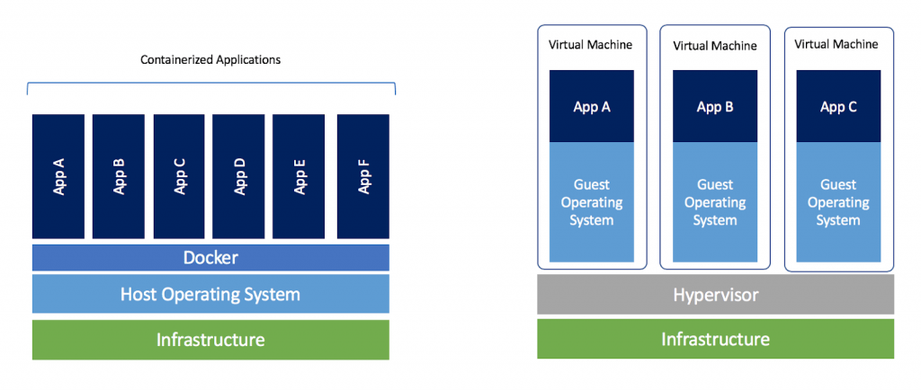

# Co to je Docker?

.footer: [5 min]

# ...je to nástroj, který umožňuje:

- vytvořit artefakt schopný běhu všude tam, kde je Docker
- zapouzdřit aplikaci včetně jejího prostředí
- redukovat problémy při nasazování aplikací
- řešit podobné úlohy jako VM

.notes: zminit napr. komplexitu nasazeni webapp na vice AS, vice OS, apod.

.notes: redukce problemu = redukuje pacive problemy dneska, prinasi ale nove (nova tech.)

#
#

.footer: Základy Docker a Kubernetes 01/2021

---
# Srovnání s VM

.footer: [5 min]

.notes: zmínit prakticky okamžité spuštění oproti nutnosti bootu VM

.notes: zmínit řádové snížení velikosti image oproti VM

---
# Linux kernel

.footer: [5 min]

- Docker je produkt založený na vlastnostech a funkcích jádra **Linuxu**
- nefunguje nativně např. na AIX, Windows ani macOS (jen s virtualizační mezivrstvou nebo s plnohodnotným Linuxem jako součástí OS)
- všechny kontejnery (viz dále) sdílí s host OS jeho linux kernel
- kontejnery nejsou nic jiného než běžné procesy uzavřené do vlastního namespace a se zdroji omezenými za pomocí control groups (obojí funkce linuxového jádra)
- kontejner tedy není žádný "aktivní obal", ale jen logicky izolovaný proces, který se tváří jako samostatná VM

---
# Motivace

.footer: [5 min]

- distribuce neměnného balíčku (=docker image) k zákazníkovi
- image se nedají měnit, ale může se z nich *dědit*
- docker image obsahuje vše potřebné pro spuštění aplikace
- image lze digitálně podepsat
- součástí image i kompletní souborový systém OS - např. OS CVE lze řešit rebuildem image
- image se verzují

---
# Image

.footer: [5 min] 

## Co je vlastně image?

- lze si představit jako .tar.gz souborového systému OS + nějaká metadata
- *image* je vždy read-only, vytváří se *buildem*
- image se většinou zakládá na nějakém již existujícím - např. JDK image dědí z Alpine linux image a dodá instalaci JDK
#
    !dockerfile
    FROM alpine
    RUN <instalace jdk>
#
(je to něco jako vzít souborový systém Alpine linuxu, nakopírovat tam JDK, zazipovat a obalit metadaty)

---

# Parent a base image

.footer: [5 min] 

- parent image referencován instrukcí `FROM`
- parent images dostupné např. na Docker HUB
- kde je ale root image? Je to image s `FROM scratch`, ale častěji se vytváří importem zazipovaného souborového systému:

.notes: zmínit absenci init

.notes: scratch je rezervovaný název - prázdný parent image

#
    !bash
    $ sudo debootstrap xenial xenial > /dev/null
    $ sudo tar -C xenial -c . | docker import - xenial

    a29c15f1bf7a

    $ docker run xenial cat /etc/lsb-release

    DISTRIB_ID=Ubuntu
    DISTRIB_RELEASE=16.04
    DISTRIB_CODENAME=xenial
    DISTRIB_DESCRIPTION="Ubuntu 16.04 LTS"    
#
#

---

# Kontejner

.footer: [5 min] 

- *kontejner* je vlastní aktivní proces spuštěný nad souborovým systémem z image (lze si představit jako *instanci* image)
- spuštění kontejneru s aplikací = spuštění procesu aplikace na systému, kde běží Docker daemon, ale proces je izolován ve vlastním *namespace* a běží jako root proces (PID 1)
- root procesem host OS je zpravidla initd nebo systemd - kontejner init proces nemá, protože nebootuje, začíná přímo spuštěním procesu

---
# Docker daemon

.footer: [5 min] 

- proces běžící na pozadí
- spravuje Docker objekty (image, kontejnery, síť, úložiště)
- občas je potřeba změnit konfiguraci: /etc/docker/daemon.json (typicky kvůli insecure registry)
- musí běžet jako root - často terčem kritiky (v kombinaci s root právy uživatele v kontejneru)

---
# OCI

.footer: [5 min] 

- Open Container Initiative
- představuje otevřený standard rozhraní container runtime a formátu image
- díky OCI mohlo Kubernetes opustit docker daemon a přejít na containerd
- vzhledem k raketovému rozvoji kontejnerizace je OCI nutnost
- mezi OCI-compliant runtime patří např. docker, cri-o a containerd (docker již ale interně používá containderd)
#

---
# Docker CLI

.footer: [5 min] 

- základní (a naprosto dostačující) utilita pro vytváření, správu a manipulaci s docker objekty
- build image: `docker build -t myimage:1.0` .
- spuštění kontejneru: `docker run -d -name mycont1 -p 8088:8080 myimage:1.0`

---
# Dockerfile

.footer: [5 min] 

- textový soubor obsahující instrukce pro build image
- proprietární formát
- pokud není určeno jinak, předpokládá se název `Dockerfile`

---
# Příklad (1)

.footer: [5 min]

(examples/docker-simple)

    !dockerfile
    FROM nginx:alpine
    COPY . /usr/share/nginx/html

.notes: objasnit nginx:alpine

Vytvoříme image: `docker build -t docker-simple:0.1 .`
Spustíme: `docker run -ti --rm -p 8881:8080 docker-simple:0.1`

`docker <group> [options] <image> [command]`

http://localhost:8881

---
# Příklad (2)

Zastavíme kontejner (běží na popředí): Ctrl+C (pošle SIGINT, ne SIGKILL)

Spustíme na pozadí: `docker run -d --name docker-simple -p 8881:8080 docker-simple:0.1`

Ověříme, že běží:

- docker ps
- docker logs -f docker-simple

---
# Příklad (3)

Prozkoumáme kontejner (pocitově jsme už *jako kdyby* ve VM):

- `docker exec -ti docker-simple sh`
- `cd /usr/share/nginx/html`
- `ls -l`:

        !bash
        50x.html    Dockerfile  build.sh    index.html

Pokusy:

- `hostname`
- `ps`
- `ls -la /`
- `uname -a`
- `cat /etc/*release`

---
# Příklad (4)

Uklidíme:

- `exit`
- `docker ps`
- `docker stop/kill docker-simple`
- `docker ps -a`
- `docker rm/rm -f docker-simple`
- `docker ps -a`

...a nikde nic...EPHEMERAL! :-)

(pozor, spolu s kontejnerem zmizí i vše, co vyprodukoval, pokud neprodukoval na VOLUME)

---
# docker kontext

.footer: [5 min] 

...vraťme se ještě na slide **[Příklad (3)](#slide:14)**: co tam dělá Dockerfile a build.sh???

Chtěli jsme to přece: `COPY . /usr/share/nginx/html`

Řešení je snadné - filtrace kontextu pomocí `.dockerignore` (obdoba .gitignore) - např.:

    !bash
    .git
    .cache
    target
    **/*.class
    *.md
    !README.md

...a pro náš příklad:

    !bash
    *.sh
    Dockerfile*

Zkusme tedy nový build...   

---
# Přestávka

.footer: [15 min]

---
# Dockerfile - příkazy (1)

.footer: [15 min] 

Inspirace: <https://repogit.trask.cz/git/BI_Docker>

Vybrané příkazy:

- [`FROM`](https://docs.docker.com/engine/reference/builder/#from)
- [`ADD`](https://docs.docker.com/engine/reference/builder/#add)
- [`COPY`](https://docs.docker.com/engine/reference/builder/#copy)
- [`RUN`](https://docs.docker.com/engine/reference/builder/#run)
- [`USER`](https://docs.docker.com/engine/reference/builder/#user)
- [`WORKDIR`](https://docs.docker.com/engine/reference/builder/#workdir)

---
# Dockerfile - příkazy (2)

- [`EXPOSE`](https://docs.docker.com/engine/reference/builder/#expose)
- [`VOLUME`](https://docs.docker.com/engine/reference/builder/#volume)
- [`ENTRYPOINT`](https://docs.docker.com/engine/reference/builder/#entrypoint)
- [`CMD`](https://docs.docker.com/engine/reference/builder/#cmd)
- [`ENV`](https://docs.docker.com/engine/reference/builder/#env)
- [`ARG`](https://docs.docker.com/engine/reference/builder/#arg)

---
# PID 1, exec vs shell formy

.footer: [25 min] 

Existence kontejneru je přímo spojena s životem procesu s PID 1.

Rozdíl mezi:

- ENTRYPOINT "/app/bin/your-app arg1 arg2" (shell-form)
- ENTRYPOINT ["/app/bin/your-app", "arg1", "arg2"] (exec-form)

Pěkně vysvětleno: <https://hynek.me/articles/docker-signals/>

---
# Build, Vrstvy, multi-stage build

.footer: [30 min] 

- Každý příkaz v rámci Dockerfile = vrstva v souborovém systému
- vrstvy jsou read-only, zápisová je jen ta "vrchní"
- copy-on-write
- vhodná organizace vrstev tak, aby je nebylo nutné zbytečně buildovat/stahovat

Příklad buildu + push, pull (docker-images/mdr)

Dokumentace: <https://docs.docker.com/storage/storagedriver/>

---
# Názvy images, Docker repository

.footer: [5 min] 

Název image: `[host:port/]<repository1>/<repository2>/.../<image-name>[:<image-version>]`

Např.:

- trask/tif/mdr:3.1.21
- harbor.trask.cz/arm64/keycloak:12.0.1
- localhost:5000/redis

Pokud chybí verze image, použije se `latest` (má nevýhody)

---
# Docker registry - secure/insecure, harbor.trask.cz

.footer: [5 min] 

`[host:port]` z předchozího slidu = docker registry (pozor, registry vs repository)

.....

---
# pull, push, tag, login/logout

.footer: [10 min] 

---
# Přestávka na oběd

.footer: [30 min - 1 h] 

---
# PID 1 podrobněji

.footer: [30 min] 

---
# Uživatelské účty a oprávnění uvnitř kontejneru, USER

.footer: [15 min] 

---
# Publikace portů, EXPOSE

.footer: [15 min] 

---
# Volumes, mount, VOLUME

.footer: [15 min] 

---
# Networking, komunikace mezi kontejnery

.footer: [15 min] 

---
# Přestávka

.footer: [15 min]

---
# Docker best practices

.footer: [25 min] 

---
# Orchestrace – Docker Compose, Docker Swarm

.footer: [5 min] 

---
# Přidělování CPU a paměti

.footer: [5 min] 

---
# Kontejnerizace Java aplikace, JIB

.footer: [55 min] 

---
# Diskuse 
